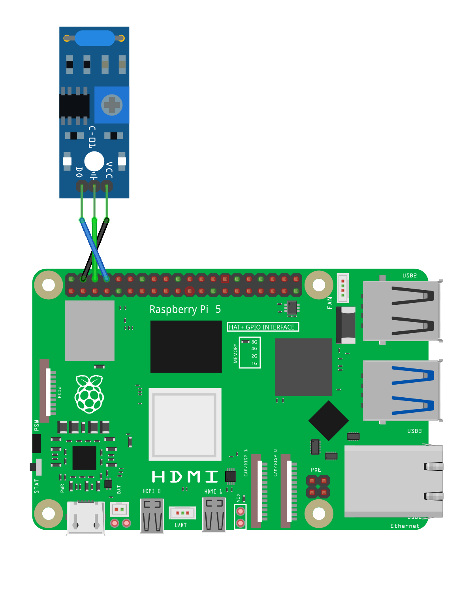

# vibinator

This is a complementary app to my [washerbot app](https://github.com/jcostom/washerbot). I'm using washerbot to monitor the Kasa smart plug that our washer is plugged into. By monitoring power use through the plug's API, I can tell when the washer finishes a load and then kick out a notification to the family.

Ordinarily, I'd just recycle that code and just spin another instance of the same container to monitor the dryer, but there's a hitch. We've got an electric dryer, and nobody makes a 240V 30A smart plug. If we had a gas dryer I could do it, but I'm not about to buy a new dryer just to support notifications.

So, instead of monitoring voltage, we'll look at vibration. When the dryer is running, it's vibrating. I'm using an 801s vibration sensor, wiring up +5V DC, Ground, and Digital Output from the sensor to the Pi.

**Update**: As of v3.0, I'm rewriting some of the code here to migrate to the gpiozero Python module. Why do this? The Raspberry Pi 5 completely changed how GPIO works. Fortunately, the gpiozero module supports both old-style GPIO as well as the Pi 5! Also as of v3.0, I'm discontinuing support for non-64-bit ARM platforms.

Check out the example docker-compose file for how you should be launching this thing. Environment variables, with their default values follow:

* TZ: Your Time Zone, default is America/New_York*
* INTERVAL: your polling interval, default is 120s (internally, this is carved into 4 slices)
* SENSOR_PIN: which GPIO pin you're using for the sensor, default is pin 14
* AVG_THRESHOLD: above this value, you declare the dryer as being "on", used to prevent false positives if you're in a "noisy" environment. Default is 0.4
* DEBUG: logs more data during monitoring - useful for debugging monitor intervals and threshold levels, default is False. Set to True if you want more logs. Don't leave this on forever if you use a Pi with a flash card, as flash cards have a finite number of write ops.

You should run this container in privileged mode.

## Wiring and tuning your sensor

I'm using an 801s sensor, which definitely needed some tuning. Typically there's a little screw on the sensor, and you turn it with a screwdriver to tune. They can sometimes be fiddly. If you're tuning, consider dialing down the INTERVAL, and turn on DEBUG while you're tuning. Here's what mine looks like. You don't have to do the same, but I can at least say it works.

## Notifications

As of v2.5 of the container, multiple notification types are supported. Yes, you can do multiple notification types simultaneously too!

### Setting up Telegram

There are a ton of tutorials out there to teach you how to create a Telegram Bot. Follow one and come back with your Chat ID and Token values. Set the USE_TELEGRAM variable to 1, and set the TELEGRAM_CHATID and TELEGRAM_TOKEN variables and you're set. The old variables of CHATID and MYTOKEN still work as well, but be a good citizen and update to the new variable names please.

### Setting up Pushover

1. Sign up for an account at the [Pushover](https://pushover.net/) website and install the app on your device(s). Make note of your User Key in the app. It's easy to find it in the settings.

2. Follow their [API Docs](https://pushover.net/api) to create yourself an app you intend to use.

3. Pass the variables USE_PUSHOVER (set this to 1!), PUSHOVER_APP_TOKEN, and PUSHOVER_USER_KEY into the container and magic will happen.

### Setting up Pushbullet

1. Sign up for an account at the Pushbullet website.

2. In the Settings > Account page, setup an API key.

3. Pass the variables USE_PUSHBULLET and PUSHBULLET_APIKEY to the container and wait for magic.

### Setting up Alexa Notifications

1. Add the "Notify Me" skill to your Alexa account

2. Note the accessCode value from the email you got from the skill.

3. Pass the variables USE_ALEXA and ALEXA_ACCESSCODE to the container, and wait for the glowing ring on your Echo!